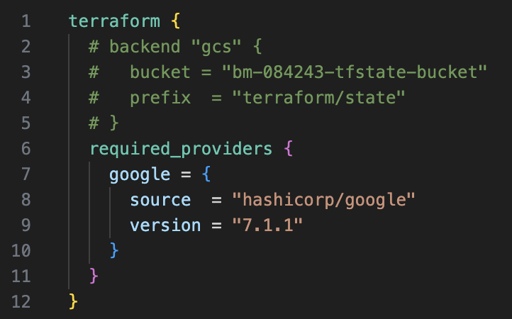

# Terraform practical task GD

This project defines a simple GCP cloud infrastructure using Terraform.  
It deploys a basic website behind an **external HTTP load balancer**.  
The backend consists of **1 Managed Instance Group (MIG)** with 3 VM instances.  

The website runs on the **Apache HTTP server** (port 80).

---

## How to use

1. **Download this repository**

2. **Create a `terraform.tfvars` file** and provide values for the variables.  
    Example:

    ```hcl
    count_vms    = 3
    prefix       = "random"
    project_name = "gd-gcp-my-project"
    region       = "europe-central2"
    vm_zone_main = "europe-central2-a"
    ```

3. **Initialize and deploy**
    Run:

    ```bash
    terraform init
    terraform apply
    ```

    * This will deploy a Cloud Storage bucket resource for the Terraform state backend.
    * Copy the name of the bucket from the Terraform output in your terminal.

4. **(Optional)** Enable remote state storage

   * Uncomment the `"backend"` block in `main.tf`.
   * Replace the bucket name with the one from step 3 to store your `.tfstate` file remotely in GCS.

<p align="center">
  
</p>

---

## Results

After applying the configuration, Terraform outputs look like this:

```hcl
Outputs:

bucket_name     = "bm2-9762-tfstate-bucket"
load_balancer_ip = "31.32.33.34"
```
* `bucket_name` → Name of the Cloud Storage bucket used for the remote Terraform state.
* `load_balancer_ip` → Public IP address of the external HTTP load balancer.

Using the provided IP address, we can connect to the website and observe the load balancer in action:

<p align="center">
  
</p>

After refreshing the page (the request is handled by another VM in the MIG):

<p align="center">
  
</p>

---

## Notes

* **Restricting traffic with firewall rules:**
  Regular firewall rules cannot effectively restrict access in this setup. This is because the VMs are in the backend, but all traffic goes through the **external load balancer**.
  To control incoming traffic, you need to use **security policies** attached to the Load Balancer itself.

* **Rules in the Cloud Armor policy implemented:**

  1. Deny all incoming traffic (`*`) by default.
  2. Allow traffic only from a specific IP range: **37.0.0.0/8**.

